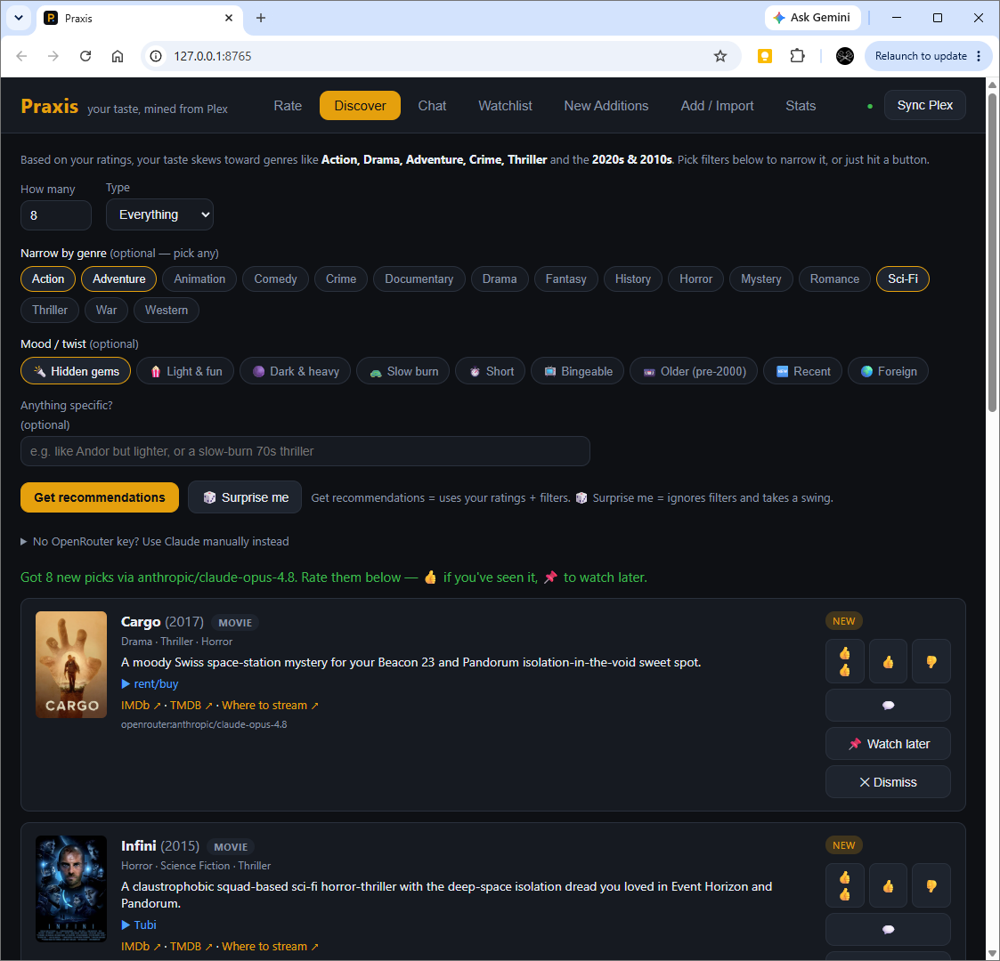
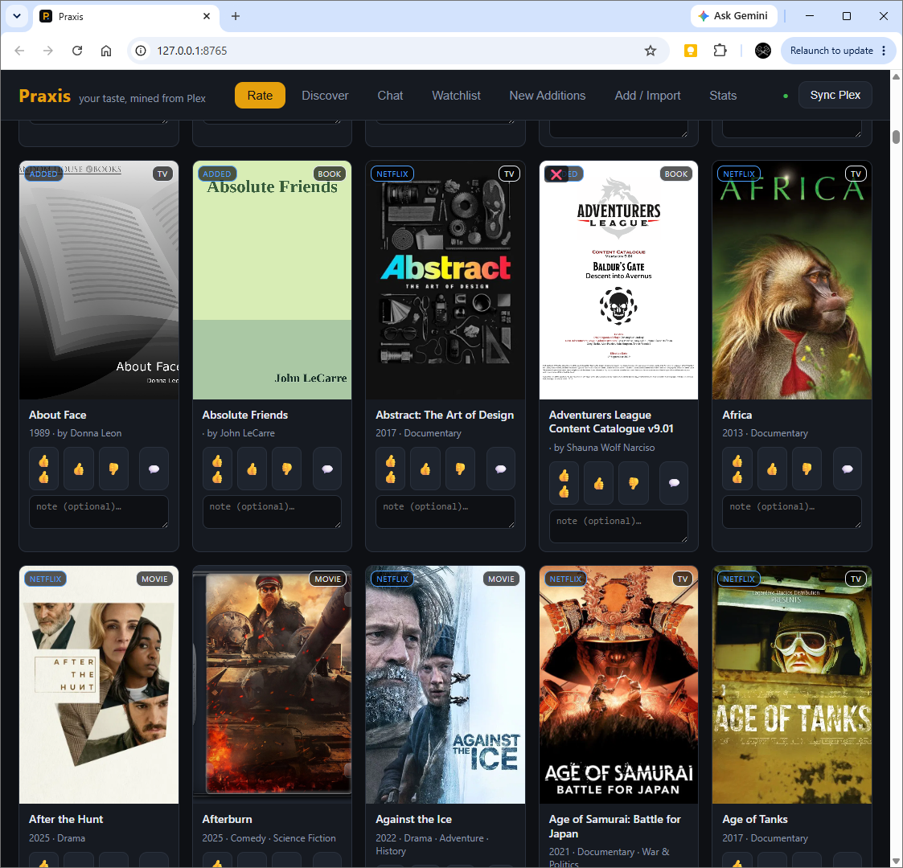
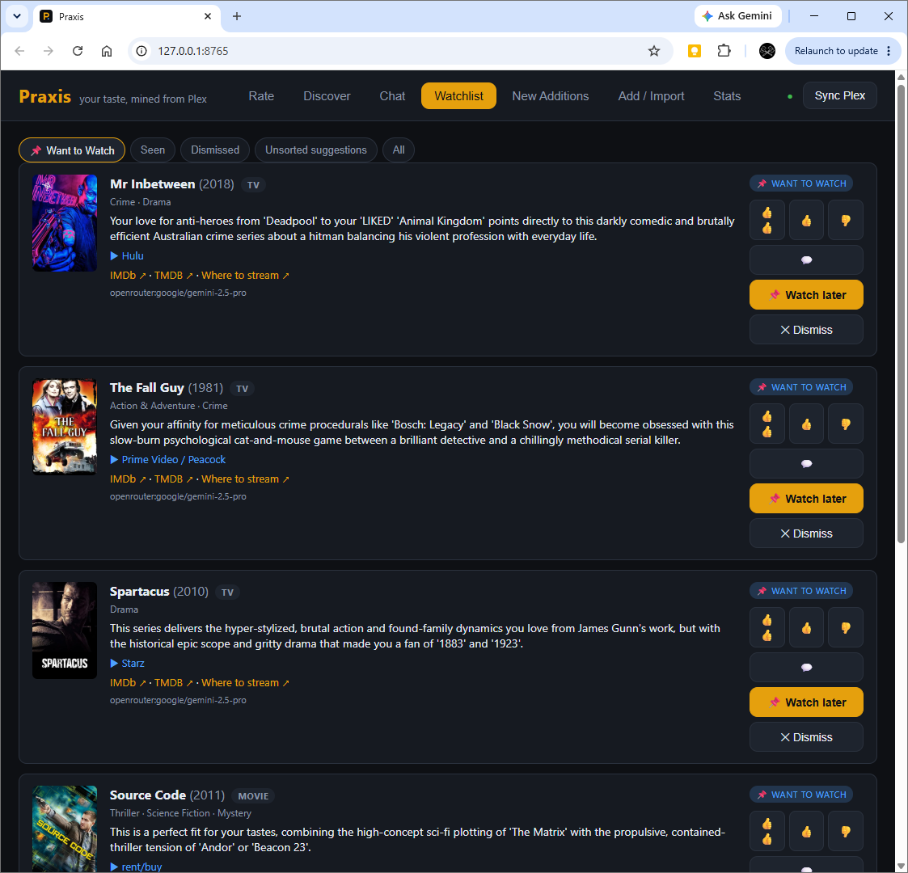
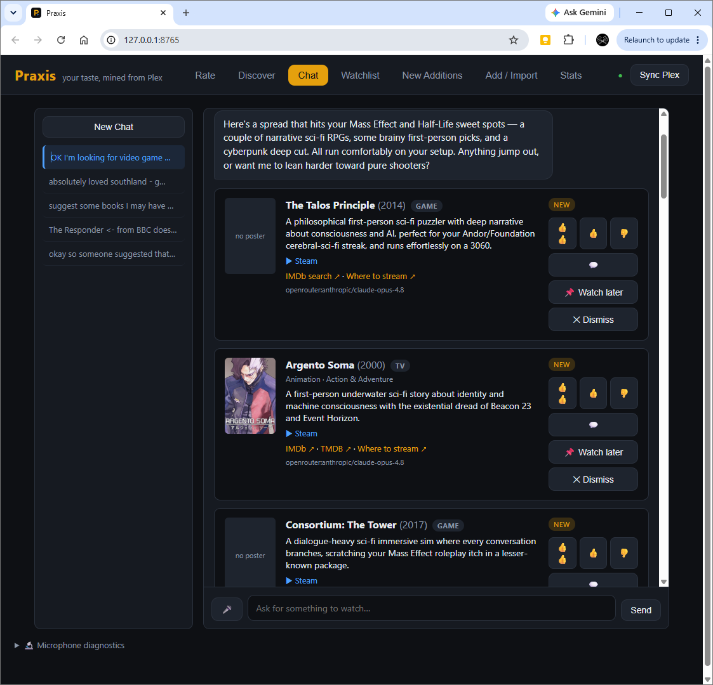

# Praxis

A small local app that mines your **Plex** library for movies and TV shows, lets you scan your **PC Games** and **E-books**, lets you rate everything fast (Netflix-style thumbs), builds a comprehensive taste profile, and asks an LLM (via your **OpenRouter** account) for fresh movies, shows, games, and books you haven't seen — tracking every recommendation so nothing gets forgotten or suggested twice.

Everything runs locally on your machine. Your Plex token never leaves it, and your API keys live only in `config.json` (git-ignored — see [Privacy](#privacy)).

## Screenshots

> _Add your own screenshots to `docs/screenshots/` (the repo references the files below). They'll render here once present._

| Discover | Rate |
|---|---|
|  |  |

| Watchlist | Chat |
|---|---|
|  |  |

## Quick start

```bash
# 1. install dependencies (once)
python -m pip install -r requirements.txt

# 2. set up your config
#    copy the template, then fill in your keys:
#      cp config.example.json config.json   (Windows: copy config.example.json config.json)
#    - openrouter.api_key        -> for recommendations + chat
#    - tmdb.read_access_token    -> for posters/metadata enrichment
#    (both optional to start; see Platforms below for the Plex token)

# 3. run
python run.py
```

Your browser opens to <http://127.0.0.1:8765>. Click **Sync Plex** once to pull your library, then start rating.

## Platforms & Setup

Pure Python + a static web UI (no Node/build step). **Python 3.11+.**

- **Windows:** the Plex token is read automatically from the registry — nothing to configure.
- **macOS / Linux:** there's no registry, so set the token manually. Grab it from the Plex web app (open any item → ⋯ → *Get Info* → *View XML*; the URL contains `X-Plex-Token=…`) or from `Preferences.xml`, and put it in `config.json` under `plex.token`. Everything else works identically.
- Adjust `plex.base_url` if your server isn't at `http://localhost:32400`, and `plex.movie_section` / `plex.show_section` if your library section keys differ.

## The Four Media Integrations (Deep Dive)

Praxis tracks four distinct media types, automatically pulling deep metadata from different sources so you don't have to manually enter anything.

### 1. Movies & TV (Plex + TMDB)
- **Scanning:** Praxis automatically connects to your local Plex Media Server (`http://localhost:32400`) to sync your entire movie and TV library. Sync is idempotent — it updates metadata and adds new titles without touching your ratings.
- **Enrichment:** Queries **TMDB (The Movie Database)** to download official posters, genres, release years, and plot summaries. Requires `tmdb.read_access_token` in `config.json`.

### 2. PC Games (Local Folders + Steam)
- **Scanning:** Point Praxis at your local game installation directories (e.g., `D:\Games`). It uses an aggressive regex engine to automatically strip scene release tags (like `[GOG]`, `v1.2`, `Repack`) and extract the clean game title.
- **Enrichment:** Queries the public **Steam API** to fetch official game capsules (cover art), developers, and game genres. No API key required.

### 3. E-Books (Local Folders + Google Books)
- **Scanning:** Point Praxis at your e-book folders. It natively parses metadata headers directly from `.epub`, `.mobi`, `.azw3`, and `.pdf` files to extract the exact book title and author.
- **Enrichment:** Queries the public **Google Books API** to download high-resolution book covers and literary genres. No API key required.

### 4. Netflix History (CSV Import)
- **Import Netflix history:** upload your `NetflixViewingHistory.csv`. Episode rows are collapsed into show titles (smartly: *Hulk Hogan: Real American: Limited Series: Hulkamania* → the show, but *Nemesis: A Long Time Coming* stays a movie), and everything imports as **watched** so it won't be re-recommended. Titles you already have are skipped automatically.

*(You can also **Add a title you watched elsewhere** manually — for stuff not in Plex, like Wrexham on Hulu, etc. It feeds your profile and is excluded from future recommendations.)*

## How it works

### Rating (Netflix model)
- **👍👍 two thumbs up** = Love it
- **👍 one thumb up** = meh-to-good
- **👎 thumbs down** = Nope
- **no thumbs** = haven't watched / not yet rated

Plus an optional one-line **note** per title — this is the single most useful signal for the AI (e.g. *"loved the first two seasons, fell apart after"*, *"great combat mechanics"*, *"couldn't put this book down"*). Click a verdict again to clear it. Keyboard: `2` love · `1` like · `3` nope · `0` clear · `n` next.

### Discover Engine
Pick how many recommendations, select your media types (movies/TV/games/books/all), and an optional **vibe steer** (*"like Andor but lighter"*, or *"a sci-fi RPG like Mass Effect"*). 

Praxis builds a prompt from your ratings + a full exclusion list (everything you own or were already shown) and asks the model. Each pick that comes back is **automatically looked up on TMDB / Steam / Google Books** and rendered as a real card — poster, year, genres — and every card is rateable:

- **👍👍 / 👍 / 👎** = *"I've already seen this"* — it gets added to your rated library, which shapes your taste profile **and excludes it from all future recommendations**. (Crucial, because plenty of recs are things you watched in the decades before Plex/Netflix were tracking you.)
- **📌 Watch Later** = sends it to your Want-to-Watch queue.
- **✕ Dismiss** = not interested.

No key? Click **Copy prompt for Claude**, paste it into any Claude chat, then paste the answer back via **Import recommendations** (those get enriched too).

### Chat & Natural Language Actions
A conversational tab that talks to your chosen model **grounded in your taste profile** — it already knows what you've loved, liked, and panned across all 4 media types. Ask things like *"what's a short, funny thing for tonight?"*

It can also **take actions** — just tell it in plain language:
- *"Add the A-Team and the original 1980s MacGyver as loved shows"* → they're added to your rated library (year-disambiguated so you get the 1985 MacGyver, not the reboot).
- *"I just finished reading Dune and playing Half-Life 2, loved them both"* → adds the book and the game to your profile.
- *"Put Quantum Leap on my watch later list"* → goes to your Want-to-Watch queue.

There's a **🎤 mic button** for voice input (browser-native speech recognition; it listens continuously and **stops when you click away** from the box, or click the mic again). `Enter` sends, `Shift+Enter` for a newline.

### Sorting & filtering (Rate tab)
Sort by Title, Year (newest/oldest), Recently added, Recently rated, or **Random shuffle** (great for rating variety). Filter by source — **Plex / Netflix / Added / Games / Books** — so you can focus on, say, just your Plex titles and ignore the imported flood.

### Watchlist (your Want-to-Watch area)
Every recommendation, grouped by status: **📌 Want to Watch / New picks / Seen / Dismissed**. The same rate buttons work here too — so when you actually watch/play/read something from your queue, thumb it and it moves into your rated library. This is your memory so you stop re-deriving the same conclusions.

### Stats
% of library rated, verdict breakdown, the genres/directors/eras you gravitate to, and the recommendation funnel.

## Configuration (`config.json`)

| Key | Meaning |
|---|---|
| `plex.base_url` | Plex server URL (default `http://localhost:32400`) |
| `plex.token` | Leave blank to auto-read from the Windows registry; set to override |
| `plex.movie_section` / `plex.show_section` | Library section keys (default 1 / 2) |
| `plex.sync_on_start` | Re-index Plex automatically on launch (default `true`) |
| `openrouter.api_key` | Your OpenRouter key (required for in-app recommendations + chat) |
| `openrouter.model` | Model slug, e.g. `google/gemini-2.5-pro` or `anthropic/claude-opus-4.8` |
| `openrouter.max_tokens` | Output cap per request (default 4000) |
| `openrouter.reasoning_effort` | `low`/`medium`/`high` thinking budget for reasoning models (default `low` — keeps cost down and avoids empty replies) |
| `tmdb.read_access_token` | TMDB API Read Access Token (preferred) for metadata enrichment — themoviedb.org → Settings → API |
| `tmdb.api_key` | Optional legacy v3 key; only used if no read access token is set |
| `server.port` | Port to serve on (default 8765) |

## Layout
```
praxis/        backend: config, db (SQLite), plex, tmdb, games, books, recommend, importers, server (FastAPI)
web/           frontend: index.html, app.js, style.css
data/praxis.db your database (git-ignored, created on first run)
run.py         launcher
```

## Privacy
Everything is local and personal, and the repo is set up so none of it leaks:

- **API keys** live only in `config.json`, which is **git-ignored**. The committed `config.example.json` has blank placeholders. Never commit `config.json`.
- **Your ratings & library** live in `data/praxis.db` (git-ignored).
- **Viewing-history exports** (`*.csv`, e.g. `NetflixViewingHistory.csv`) are git-ignored too.
- Your Plex token and watch data never leave your machine; only recommendation prompts (your taste profile, no credentials) are sent to OpenRouter.

If you fork this, double-check `git status` before your first commit to confirm `config.json` and `data/` are not staged.

## Tech
Python 3.11+ · FastAPI · SQLite · vanilla JS. No build step.
